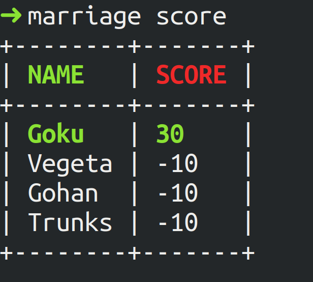

# Marriage Score Calculator
My family loves playing the [Marriage Card Game](https://en.wikipedia.org/wiki/Marriage_(card_game)) but we hate having to keep track of the weird scoring system and determining who won at the end of the game

I will only do something manually once. The second time I need a program. Here's the program to handle that and let us focus on purely playing the game and leave the scoring to the dumb machine

# PSA
This is my very first Golang project so the code is probably not very idiomatic. I am looking to improve it as much as possible so if by some chance you find yourself here, do take a look at the code and suggest improvements I can make

# Install
Simply download the relevant binary from the `Releases` tab for your operating system and rename the file to just `marriage`

# Sample usage
Naviate to the [examples](./examples) directory. Let's consider the following example `config.yml` file:

```yaml
players:
  - Goku
  - Vegeta
  - Gohan
  - Trunks
rounds: 1
```
Run `marriage start` to generate the following `game.yml` file:
```yaml
rounds:
- roundnum: 1
  players:
  - name: Goku
    score: 0
    winner: false
    pachayo: false
  - name: Vegeta
    score: 0
    winner: false
    pachayo: false
  - name: Gohan
    score: 0
    winner: false
    pachayo: false
  - name: Trunks
    score: 0
    winner: false
    pachayo: false
```
This is the game configuration file that will be used to keep score. However you choose to keep score is up to you and you can modify the `score` value freely. The only enforced rule here is:
> The player who ends the game will get 10 points from each of the players who have not completed primary/pure rounds, and 3 points from each of the players who have done so
-- <cite>[Wikipedia](https://en.wikipedia.org/wiki/Marriage_(card_game))</cite>

If a player has not completed the primary round, mark the `pachayo` key as false for that player for that round. Mark `winner: true` for the player that won the round. That will be sufficient to handle the enforced scoring rule. You can choose to compute the `score` field however you want besides that

## Scoring the game
To score the game, simply run:
```bash
marriage score
```
or
```bash
marriage score -g <other_file>.yml
```
if using some other game yml file besides the default `game.yml` file

You will see an output like this:



Goku won. He always does

# Features
*You can always run `marriage -h` or `marriage <subcommand> -h` to see the help options in the tool*

If you choose to use your differently named `config.yml` file, you can run:
```bash
marriage start -f [--file] <custom_file>.yml
```
to generate the `game.yml` file

If you want to save the `game.yml` file as something else (maybe you don't want to overwrite a previous `game.yml` file), you can run:
```bash
marriage start -o [--out] <custom_out>.yml
```

If you then want to score this game file instead, you can run:
```bash
marriage score -g [--game] <custom_out>.yml
```

